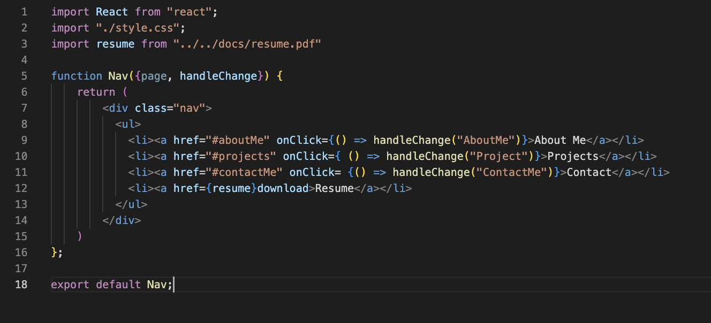
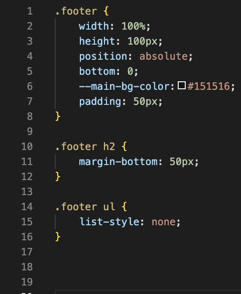
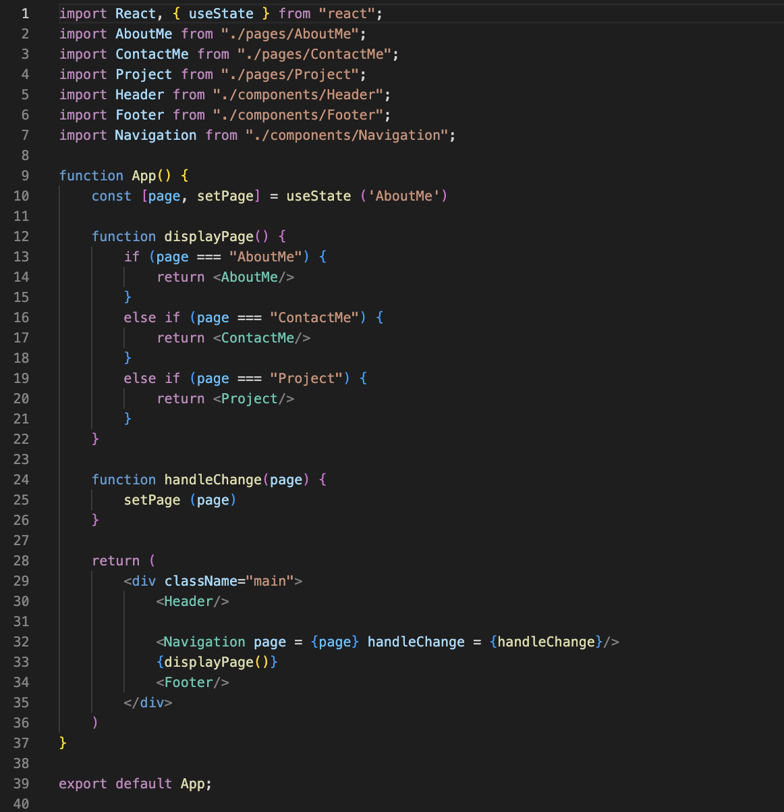
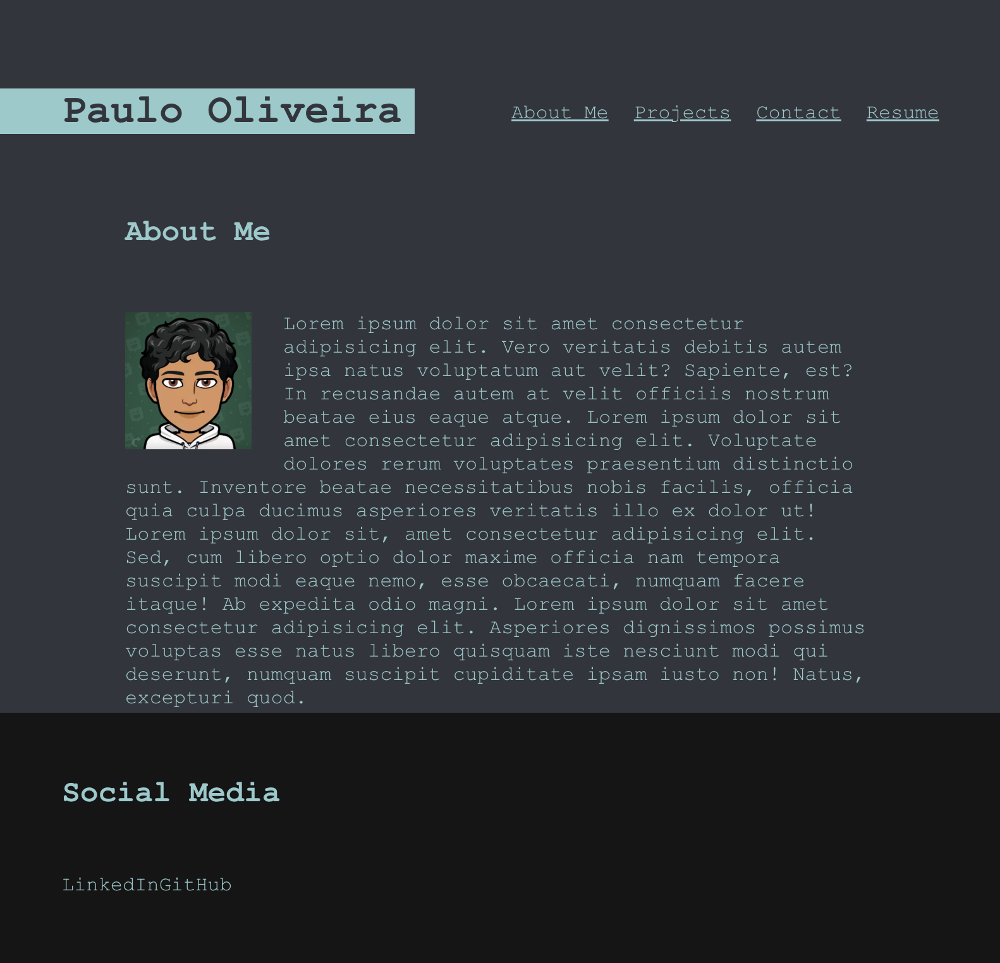

# React Portfolio

- [instalation](#instalation)
- [usage](#usage)
- [contribution](#contribution)
- [tests](#tests)

  ## description 
  React Portfolio is a web-application that renders a single page portfolio website composed of various components.
  
  ## instalation
  Clone repository into local machine, install dependencies: react, react-dom, react-scripts, and web-vitals, and finaly run "npm start" on terminal.

  ## usage
  The application is used to display a single page portfolio react application.

  ## license
  MIT

  ## contribution
  Paulo Oliveira

  ## tests
  NPM tests for components

  ![Finished and deployed web-application] (https://paulooliveira152012.github.io/horiseon-2-/)

![GitHub-repository] (https://github.com/paulooliveira152012/React-Portfolio)

Component Screen-shot

CSS Screen-shot

app.js Screen-shot

Deployed application Screen-shot

